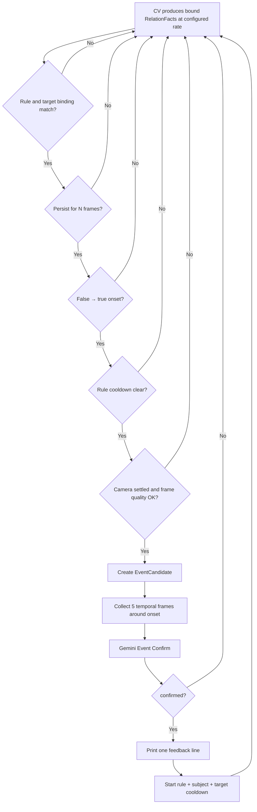

# NoticeBot Gemini + CV 重构与本机 E2E 计划

> 状态：Gemini production path 已实现；stable entity IDs 等增强项继续迭代  
> 分支：`sonen/modification`  
> 目标：用户用一句自然语言委托 NoticeBot；系统用本机 webcam、CV 和 Gemini 找到对应事件；确认后只在终端输出一行反馈，不控制舵机、CoreS3、灯光或声音。

真机到货后的安全顺序、GO/NO-GO 和剩余接口见 `docs/MACHINE_E2E_READINESS.md`。

## 0. 一句话版本

```text
用户输入 → Gemini 看 5 个空间视角并生成可执行 Plan → CV 在本地约 1 Hz 持续观察
→ CV 候选事件触发 → 取同一视角前后 5 帧给 Gemini 确认 → 终端输出一行反馈
```

核心原则：**Gemini 负责理解“用户想看什么”和最终确认；CV 负责低成本、持续地找候选事件。** Gemini 不逐帧运行。

---

## 1. 当前代码和目标架构的区别

| 项目 | 迁移前 | 当前实现 |
|---|---|---|
| Planner 模型 | Anthropic Claude | Gemini，模型名可通过环境变量切换 |
| Planning 图像 | 多视角拼成 1 张 contact sheet | 5 张独立空间帧，在同一次 Gemini 请求中依次传入 |
| CV 输出 | 全局 `relation_id -> bool` | 带人物、目标物、时间和证据的 `RelationFact` |
| 触发后流程 | CV fired 后直接进入 finding/story | CV 先生成 candidate，再由 Gemini 看 5 张时间帧确认 |
| Judge | Anthropic；主要在 story 最后调用 | Gemini；在进入 finding 前调用，返回结构化 JSON |
| 用户反馈 | Story/feed，以及机器人动作 | MVP 只输出一行：`[FEEDBACK] ...` |
| 纯电脑 webcam E2E | 主入口仍强制连接舵机，不能真正独立运行 | 增加 `--robot none --feedback console` |
| Gemini 视频脚本 | 已有独立 smoke test，上传整段本地视频 | 保留作实验工具；正式实时链路使用 5 张图片，不上传持续视频 |

`planning/gemini_video_trigger.py` 保留为独立 whole-video smoke test；production 主循环通过共享 Gemini provider 完成独立空间图片 Planning 和五时间帧 Confirm。

---

## 2. 会用到哪些 Service、Key 和本地组件

### 2.1 Service / Key 总表

| Service / 组件 | 用途 | 是否联网 | 需要的 Key / 配置 | MVP 是否必须 |
|---|---|---:|---|---:|
| Gemini Developer API | 5 视角 Planning；5 时间帧 Event Confirm；生成一行反馈 | 是 | `GEMINI_API_KEY`、`NOTICEBOT_GEMINI_MODEL` | 是 |
| OpenCV | webcam 读取、帧缓存、JPEG 编码、预览和 overlay | 否 | camera index，如 `--cam 0` | 是 |
| MediaPipe | Face landmarks、head pose、人体 pose、手腕/肩/髋关键点 | 首次模型准备后本地 | 无 Key；模型在 `perception/weights/` | 是 |
| Ultralytics YOLO-World | 可切换的低延迟 open-vocabulary detector；后续可接 ByteTrack | 首次下载权重时联网 | 无 Key；公开权重自动下载 | 否，但保留并测试接口 |
| Grounding DINO | open-vocabulary detector 备选 | 首次下载模型时联网 | 公开模型通常无需 Key；必要时可用 `HF_TOKEN` | 否 |
| faster-whisper | 本地语音转文字 | 首次下载模型时联网 | 无 Key；`NOTICEBOT_WHISPER`、`NOTICEBOT_LANG` | 否，本机测试先文字输入 |
| Web UI | 输入用户请求、查看 raw/overlay、Plan 和事件 | 否 | `--serve --web-port 8000` | 建议 |
| Servo / CoreS3 | 机器人转头、屏幕、灯光、声音 | 否 | 串口配置 | 此阶段不使用 |
| 数据库 / 云存储 | 不需要；Plan、事件、图片先写本地 | 否 | 无 | 否 |

Gemini 参考文档：[Models](https://ai.google.dev/gemini-api/docs/models)、[多图理解](https://ai.google.dev/gemini-api/docs/image-understanding)、[Structured Output](https://ai.google.dev/gemini-api/docs/structured-output)。

### 2.2 推荐环境变量

`.env` 只放本机秘密，不进入 Git：

```dotenv
GEMINI_API_KEY=replace_with_your_real_key

# 不把模型名写死在业务代码里。低延迟 smoke test 使用 Flash-Lite；
# 若账户可用模型不同，只改这里。
NOTICEBOT_GEMINI_MODEL=gemini-3.5-flash
NOTICEBOT_GEMINI_THINKING_LEVEL=minimal
NOTICEBOT_GEMINI_MEDIA_RESOLUTION=low
NOTICEBOT_GEMINI_MAX_OUTPUT_TOKENS=256
NOTICEBOT_GEMINI_SERVICE_TIER=priority

# 本机默认参数，不是秘密
NOTICEBOT_CAMERA=0
NOTICEBOT_CV_HZ=4
NOTICEBOT_LANG=zh
NOTICEBOT_FEEDBACK=console
```

兼容现有 smoke test 时，可以暂时同时支持 `GEMINI_MODEL`；重构完成后统一为 `NOTICEBOT_GEMINI_MODEL`。

### 2.3 Key 管理规则

1. 仓库只提交 `.env.example`，绝不提交 `.env`。
2. Key 只在 provider 初始化时读取；不能放进 prompt、Plan JSON、日志或 Web UI state。
3. 启动时只打印 `Gemini configured: yes/no`，不能打印 Key 的任何片段。
4. API 错误日志要过滤 request headers 和完整 payload。
5. 测试使用 fake provider，不依赖真实 Key，也不产生费用。
6. 如果 Key 曾被提交或贴进聊天，应立即在 Google AI Studio 撤销并重新生成。
7. 后续部署到共享机器时用系统 secret manager；本机 prototype 用 ignored `.env` 足够。

---

## 3. CV 包括什么

| CV 模块 | 输入 | 输出 | 建议实现 |
|---|---|---|---|
| Camera | webcam 原始视频，通常约 30 FPS | timestamped BGR frame | OpenCV `VideoCapture` |
| Frame sampler | camera frame | 默认 1 Hz perception frame；5 张 planning/event frame | OpenCV + ring buffer |
| Object detector | perception frame | 带置信度的物体 boxes | 默认 Grounding DINO；保留已测试的 YOLO-World adapter |
| Tracker | 连续 detections | 稳定的 `person_1`、`laptop_1` 等 entity id | Ultralytics ByteTrack，先不加新包 |
| Face / gaze | frame + person | face、head pose、gaze ray | MediaPipe FaceLandmarker + OpenCV geometry |
| Body pose | frame + person | shoulders、hips、elbows、wrists | MediaPipe PoseLandmarker |
| Relation evaluators | entities + tracks + pose | `RelationFact[]` | 11 个固定 evaluator |
| Trigger matcher | Plan + RelationFact stream | `EventCandidate` | onset + persist + sequence + cooldown |
| Event frame buffer | timestamped raw frames | 同一视角的 5 张时间帧 | 内存 ring buffer |
| Overlay | detections + tracks + facts | 只供人调试的画面 | OpenCV；绝不作为 Gemini 原始输入 |

### 3.1 11 种关系

| ID | Relation | 主要 CV 证据 | 是否需要目标绑定 |
|---:|---|---|---:|
| 1 | gazing-at | face/head ray 命中 object box | 是 |
| 2 | joint-attention | 两条 gaze ray 指向同一 target | 可选 |
| 3 | eye-contact | face forward 指向 camera | 否 |
| 4 | pointing/reaching | elbow→wrist ray 命中 target | 可选 |
| 5 | proxemic-zone | 人际距离 / shoulder width | 否 |
| 6 | F-formation | 多人朝向和共同 o-space | 否 |
| 7 | approach/depart | tracked distance 在时间窗内单调变化 | 可选 |
| 8 | lean-in | torso angle 朝指定 work surface / object | 是 |
| 9 | hands-on | wrist 进入/接近指定 object box 并持续 | 是 |
| 10 | gathering | person count 或 group cluster 改变 | 否 |
| 11 | turn-taking | 指定 shared artifact 的 controller id 改变 | 是 |

不要只输出 `truth[9] = true`。目标格式是：

```json
{
  "relation_id": 9,
  "relation_key": "hands_on",
  "subject_id": "person_1",
  "target_entity_id": "laptop_1",
  "confidence": 0.86,
  "started_at": 1720000000.25,
  "observed_at": 1720000001.25,
  "evidence": {
    "wrist": "right",
    "wrist_inside_target": true,
    "held_for_s": 1.0
  }
}
```

这样 `hands-on laptop` 不会被“手碰到了 cup”错误触发；`then` 也能保证是同一个 tracked person 完成前后动作。

### 3.2 采样率

| 数据 | 建议采样方式 | 原因 |
|---|---|---|
| webcam capture | 相机原生约 30 FPS | 让预览和 ring buffer 连续 |
| CV inference | Grounding DINO 接受约 **1 Hz**；YOLO-World 接口可切换到更高频率 | 用户选择准确/open-vocab 优先，同时保留低延迟路径 |
| Planning frames | 用户输入后 **5 张空间帧**，每个视角 1 张 settled raw frame | 看完整环境，不是时间序列 |
| Event frames | 候选 onset 周围 **5 张时间帧**：`t-1.0, t-0.5, t0, t+0.5, t+1.0 s` | 看 before / during / after |
| Gemini calls | 每次新 Plan 1 次；每个通过本地 gate 的 candidate 最多 1 次 | 不逐帧调用，控制延迟与费用 |

CV 的推理频率不代表相机帧率。相机仍连续采集；Grounding DINO 可以约 1 Hz 运行，YOLO-World 在需要低延迟时通过同一 detector interface 切换。Event buffer 从 raw stream 里按目标 timestamp 选最近的 5 帧。

---

## 4. 两类“五帧”到底是什么

### A. Planning 的 5 张空间帧

```text
view_1(-60°) → view_2(-30°) → view_3(0°) → view_4(+30°) → view_5(+60°)
```

它们是**大致同一时段、不同观察角度**。目的：让 Gemini 理解房间里有哪些人和物、用户说的对象在哪个视角、接下来应该监视哪里。

无机器人时，webcam 不能自己转头，因此提供两种模式：

- `--planning-view fixed`：复制/采集同一 webcam 方向的 5 张短间隔帧，用于最简单 E2E；不声称覆盖整个房间。
- `--planning-view manual`：UI 提示用户把 webcam/电脑依次朝 5 个方向，每次按空格采一张，更接近真实 sweep。

有机器人后再恢复 5 个 pan station 的自动 sweep。

### B. Event Judge 的 5 张时间帧

```text
t-1.0s → t-0.5s → t0(candidate onset) → t+0.5s → t+1.0s
```

它们是**同一观察角度、不同时间**。目的：确认动作是否真的发生以及方向，例如 approach 还是 depart、谁把 control 交给了谁。

五张图片都作为独立 image part 放在同一次 Gemini 请求中，并在每张图前放一个明确 label；不拼图，不逐张发五次 API。

---

## 5. Tentative Prompts

Prompt 不应要求模型暴露 chain-of-thought。我们给模型的是可审核的 `evidence_chain` 定义，并让它只返回结构化结论和短理由。

### 5.1 Planner Prompt

**调用时机：** 用户提交新请求，5 张空间帧准备好后。  
**输入：** 用户原句、relation catalog 的紧凑版本、5 张带 view id 的原始图片、JSON schema。  
**输出：** `PlanV2`。

Tentative system prompt：

```text
You are the planning component of a camera-based attention assistant.
Convert the user's request into a small executable watch plan using only the
provided relation catalog. Do not invent relation IDs or visual capabilities.

The five images are different spatial views, not a temporal video.
First identify relevant entities and assign stable IDs within each view.
Then choose at most three watch rules. Bind every object-directed relation to
a concrete target entity. Use the simplest rule that expresses the request.

If the request cannot be represented or an entity is not visible, report that
explicitly in missing_capabilities or assumptions. Return only schema-valid JSON.
```

动态 user payload：

```text
USER_REQUEST: 帮我看有没有人开始用我的电脑
RELATION_CATALOG_VERSION: 2.2
RELATION_CATALOG: <compact JSON>

IMAGE view_1, camera_role=planning, pan=-60
<image>
...
IMAGE view_5, camera_role=planning, pan=+60
<image>
```

建议输出：

```json
{
  "schema_version": "2.0",
  "normalized_request": "发现有人开始操作用户的电脑",
  "entities": [
    {"entity_id": "laptop_1", "label": "laptop", "view_id": "view_3", "box": [0.42, 0.30, 0.75, 0.72]}
  ],
  "best_view_id": "view_3",
  "watch_rules": [
    {
      "rule_id": "rule_1",
      "label": "someone starts using the laptop",
      "then": [
        {"relation_id": 8, "subject": "person:any", "target_entity_id": "laptop_1"},
        {"relation_id": 9, "subject": "same_as_previous", "target_entity_id": "laptop_1"}
      ],
      "within_s": 4.0,
      "persist_frames": 2,
      "cooldown_s": 60
    }
  ],
  "assumptions": [],
  "missing_capabilities": []
}
```

### 5.2 Plan Repair Prompt

只有 validator 拒绝第一次输出时调用一次：

```text
Your previous plan was not executable.
Validation errors:
- rule_1 condition 2 requires target_entity_id
- relation_id 14 does not exist

Repair only these errors. Keep the user's intent and visible entity IDs.
Return only a complete schema-valid PlanV2 JSON object.
```

第二次仍不合法时，不安装 bad plan：保留上一份 valid plan，或进入 safe fallback 并在 UI 显示错误。

### 5.3 Event Confirm + Feedback Prompt

**调用时机：** 本地 CV matcher 通过 relation、entity binding、persist、onset、cooldown 和画质 gate 后。  
**输入：** 原始用户请求、当前 rule、CV facts、5 张时间帧。  
**输出：** `EventDecision`。确认和一行反馈合并为一次 API call。

```text
You are a strict visual event verifier.
The five images are ordered temporal evidence from the same camera view.
Decide whether the requested event actually occurred and whether the subject
and target match the rule. CV facts are candidate evidence, not ground truth.

Return confirmed=false when evidence is ambiguous, target identity is wrong,
the required order is reversed, or the event is visible in only one noisy frame.
Do not infer actions outside the images. The feedback must be one short Chinese
sentence suitable for printing directly to the user. Return only JSON.
```

Payload outline：

```text
USER_REQUEST: 帮我看有没有人开始用我的电脑
RULE: <rule_1 JSON>
CV_FACTS: <bound RelationFact JSON array>

IMAGE event_t_minus_1_0s
<image>
IMAGE event_t_minus_0_5s
<image>
IMAGE event_t_0_onset
<image>
IMAGE event_t_plus_0_5s
<image>
IMAGE event_t_plus_1_0s
<image>
```

输出 schema：

```json
{
  "confirmed": true,
  "confidence": 0.91,
  "matched_rule_id": "rule_1",
  "subject_id": "person_1",
  "target_entity_id": "laptop_1",
  "evidence_frame_ids": ["event_t_0_onset", "event_t_plus_0_5s"],
  "reason": "同一人靠近并连续触碰指定电脑",
  "feedback": "我看到有人开始使用你的电脑了。"
}
```

### 5.4 Audit Prompt（非 MVP）

只有“画面里持续有人，但所有关系长时间为 false”时低频抽样，询问是否存在 vocabulary 未覆盖的重要事件。它用于研究 relation coverage，不参与第一版实时链路。

---

## 6. 调用表

| 阶段 | Trigger | 本地输入 | API 输入 | 结构化输出 | 下一步 |
|---|---|---|---|---|---|
| User input | UI submit / CLI text | 用户原句 | 无 | request id | 开始取 planning views |
| Planning | 5 个 view ready | request + 5 raw images + relation catalog | Gemini 1 call，5 image parts | `PlanV2` | validator |
| Validation | Planner 返回 | PlanV2 + evaluator registry | 无 | valid plan / errors | install 或 repair once |
| CV watch | valid plan installed | webcam + 默认 1 Hz entities/tracks | 无 | `RelationFact[]` | matcher |
| Candidate | rule 从 false→true 且 persist 达标 | facts + rule + ring buffer | 无 | `EventCandidate` | 等待后两张时间帧 |
| Confirm | 5 event frames ready | request + rule + facts + 5 raw images | Gemini 1 call，5 image parts | `EventDecision` | confirmed gate |
| Feedback | `confirmed=true` | decision.feedback | 无 | 一行 stdout | cooldown，继续 watching |
| Reject | `confirmed=false` | decision + reason | 无 | debug log，不通知用户 | 继续 watching |

反馈动作在本阶段固定为：

```text
[FEEDBACK] 我看到有人开始使用你的电脑了。
```

不调用 `robot/`、CoreS3、LED、speaker 或 motion clip。

---

## 7. Trigger 机制



Candidate key 应该是 `(rule_id, subject_id, target_entity_id)`，而不是只有 relation id。这样不同人、不同物体之间不会共享错误 cooldown。

---

## 8. Relation Catalog：JSON single source of truth

新增 `schemas/relation_catalog.v2.json`。每个 relation 包含：

```json
{
  "id": 9,
  "key": "hands_on",
  "name": "hands-on / manipulating",
  "subject_type": "person",
  "target_type": ["object"],
  "target_required": true,
  "variants": ["touch", "manipulate", "offer"],
  "evidence_chain": [
    "detect and track subject person",
    "detect and track target object",
    "estimate left and right wrist landmarks",
    "test wrist inside or near target box",
    "require the condition for at least 1.0 seconds"
  ],
  "negative_cases": [
    "wrist overlaps a different object",
    "single-frame accidental overlap",
    "target is occluded and identity is uncertain"
  ],
  "evaluator": "hands_on_v2"
}
```

JSON 定义“关系是什么意思、需要什么证据”；Python evaluator 真正执行几何计算。启动时 registry 检查 catalog 中每个可用 relation 都有实现，防止 Prompt 宣称能检测但代码里没有 evaluator。

---

## 9. Proposal 的代码改动

### 9.1 建议目录

```text
schemas/
  relation_catalog.v2.json       # 11 种关系唯一语义来源
  plan_v2.py                     # Pydantic PlanV2
  relation_fact.py               # Pydantic RelationFact / EventCandidate
  event_decision.py              # Pydantic EventDecision

planning/
  prompt_builder.py              # compact catalog + multi-image payload
  validator.py                   # schema + semantic + capability validation
  compiler.py                    # PlanV2 -> executable rules
  providers/
    base.py                      # Planner/Judge provider interface
    gemini.py                    # Gemini implementation

perception/
  detector.py                    # detector interface and YOLO adapter
  tracker.py                     # ByteTrack entity IDs
  pose.py                        # MediaPipe face/body adapter
  relation_registry.py           # catalog key -> evaluator
  evaluators/                    # one relation evaluator per file/group

events/
  matcher.py                     # all/any/not/then + entity binding
  frame_buffer.py                # raw frame ring buffer
  candidate.py                   # onset/persist/cooldown/quality gate
  gemini_confirm.py              # five temporal images -> EventDecision

feedback/
  base.py
  console.py                     # MVP: print one line only
  robot.py                       # future; this阶段不调用
```

### 9.2 分阶段修改

| Phase | 改动 | 完成标准 |
|---:|---|---|
| 1 | Relation catalog、Pydantic schemas、validator、unit tests | 非法 relation、缺 target、反向 then 都会被拒绝 |
| 2 | Gemini provider + 5 张独立 planning images | 不再依赖 contact sheet；能稳定返回 PlanV2 |
| 3 | Tracker + bound RelationFact；旧 truth vector 暂时兼容 | rule 能绑定同一 person 和指定 object |
| 4 | Candidate matcher + 5-frame ring buffer | onset、persist、sequence、cooldown 均有单测 |
| 5 | Gemini event confirm 接到 finding 前面 | 未确认事件不会进入 feedback |
| 6 | `--robot none --feedback console` | 普通 laptop + webcam 可以跑完整链路 |
| 7 | 清理旧 Anthropic production path | 已完成；MVP 只需要 Gemini key |
| 8 | 真实机器人 adapter | 单独验收，不影响 webcam-only runner |

### 9.3 必须一起修的现有问题

- Planner invalid 会重试一次；仍 invalid 时不会 install。
- `_focus_ok` 目前没有对所有 object-directed relations 做严格 target binding。
- `then` 已改为严格顺序；反向或同时发生均为 false。
- Planner 后台线程带 request generation id，STOP 或新请求后丢弃旧结果。
- CV candidate 不能在 S6/S7 继续消耗一个用户还没看到的 cooldown。
- Gemini confirm 已发生在 finding/S7 之前。
- `duration_s` 要真正终止或重新规划，而不是只存在 JSON 中。
- 退出前要 flush/join 正在 finalize 的 event，避免最后一条记录丢失。

### 9.4 依赖建议

第一版需要：

```text
google-genai
python-dotenv
pydantic>=2
opencv-contrib-python
numpy
mediapipe
ultralytics
pytest
```

YOLO 自带 ByteTrack 接口，第一版不需要额外安装 DeepSORT。也先不要加入 SAM、CLIP、action-recognition、depth estimation；只有真实测试显示某个 relation 无法达到精度时再加。

---

## 10. 本机 webcam 的真实 E2E 怎么跑

### 10.1 当前马上可跑：Gemini 视频 smoke test

这只能验证“Gemini 看视频 + 用户 trigger + JSON 返回”，**不是完整 CV→candidate→5 frame confirm pipeline**。

```bash
cd /Users/zhangjianan/Desktop/HRI/potato-sidekick

python3 -m venv .venv
source .venv/bin/activate
pip install -r requirements.txt

cp .env.example .env
# 编辑 .env，填入 GEMINI_API_KEY

python3 planning/gemini_video_trigger.py /absolute/path/to/test.mp4 \
  "当有人开始使用我的电脑时告诉我"
```

预期输出：

```json
{
  "feedback_trigger": true,
  "confidence": 0.91,
  "evidence_timestamps": ["00:04"],
  "feedback": "我看到有人开始使用你的电脑了。",
  "reason": "视频中有人靠近并操作电脑"
}
```

### 10.2 重构完成后的目标 E2E 命令

先检查 webcam index：

```bash
python3 noticebot_loop.py --list-cams
```

运行电脑-only 模式：

```bash
python3 noticebot_loop.py \
  --cam 0 \
  --robot none \
  --input text \
  --feedback console \
  --detector yolo \
  --cv-hz 1 \
  --planning-view fixed \
  --serve
```

浏览器打开 `http://localhost:8000`，在 context 输入：

```text
帮我看有没有人开始使用我的电脑
```

真实运行顺序：

1. webcam 持续采集，Web UI 显示 raw preview。
2. 用户提交文字后，程序取得 5 张 planning spatial frames。
3. 一次 Gemini call 返回 entities、best view 和 watch rules。
4. validator 通过后才 install plan；UI 显示人类可读的 rule。
5. Grounding DINO + MediaPipe 默认约 1 Hz 输出 bound RelationFacts；需要更低延迟时切换 `--detector yoloworld`。
6. 当同一个人满足指定电脑的 rule，candidate gate 记录 onset。
7. ring buffer 取 onset 前两张，再等待后两张，共 5 张时间帧。
8. 一次 Gemini call 确认事件并返回 `EventDecision`。
9. 若 `confirmed=true`，终端输出：

   ```text
   [FEEDBACK] 我看到有人开始使用你的电脑了。
   ```

10. 系统进入该 `(rule, person, laptop)` 的 cooldown，然后继续观察。

### 10.3 推荐的第一次人工 E2E 场景

固定 webcam 对着桌面，保证一个人和 laptop 都完整入镜：

1. 先保持 3 秒无人触碰电脑，建立 negative baseline。
2. 一个人进入画面，走近 laptop。
3. 手放到键盘/触控板并操作 2 秒。
4. 期望只产生一个 candidate、一个 Gemini confirm、一个 feedback line。
5. 立即重复动作时应被 cooldown 抑制。
6. 手碰旁边的 cup 不应触发 laptop rule。
7. 把“先操作、再靠近”倒序表演，不应满足 `approach then hands-on`。

保存以下调试产物，但不保存 Key：

```text
runs/<run_id>/request.json
runs/<run_id>/plan.json
runs/<run_id>/relation_facts.jsonl
runs/<run_id>/candidates.jsonl
runs/<run_id>/decisions.jsonl
runs/<run_id>/events/<event_id>/frame_01.jpg ... frame_05.jpg
```

---

## 11. MVP 验收标准

- 只配置 `GEMINI_API_KEY` 就能运行 production VLM path。
- 主入口不连接机器人硬件也能启动。
- Planner 和 Judge 都使用 5 张独立图片，不依赖 contact sheet 或整段视频。
- CV 默认以约 1 Hz 运行，但 camera/ring buffer 保持连续帧；YOLO-World 可配置为 4 Hz。
- 每个 object-directed relation 都带正确 `target_entity_id`。
- 非法 Plan、反向 `then`、错误 target、单帧闪烁都不会产生反馈。
- Gemini 返回 `confirmed=false` 时用户不会收到反馈。
- 每个已确认事件只打印一行；没有 motion、LED、CoreS3 或声音副作用。
- 无 API key 的 unit/integration tests 使用 fake provider 并完全可重复。

## 12. 最终建议

先实现 Phase 1–6，形成一个可以在 laptop webcam 上反复测试的闭环，再接真实舵机和 CoreS3。最重要的边界不是换一个模型，而是把 **Plan schema、entity binding、candidate trigger、Gemini confirm、feedback adapter** 五个接口固定下来；这些接口稳定以后，Gemini 型号、detector 和机器人硬件都可以独立替换。
